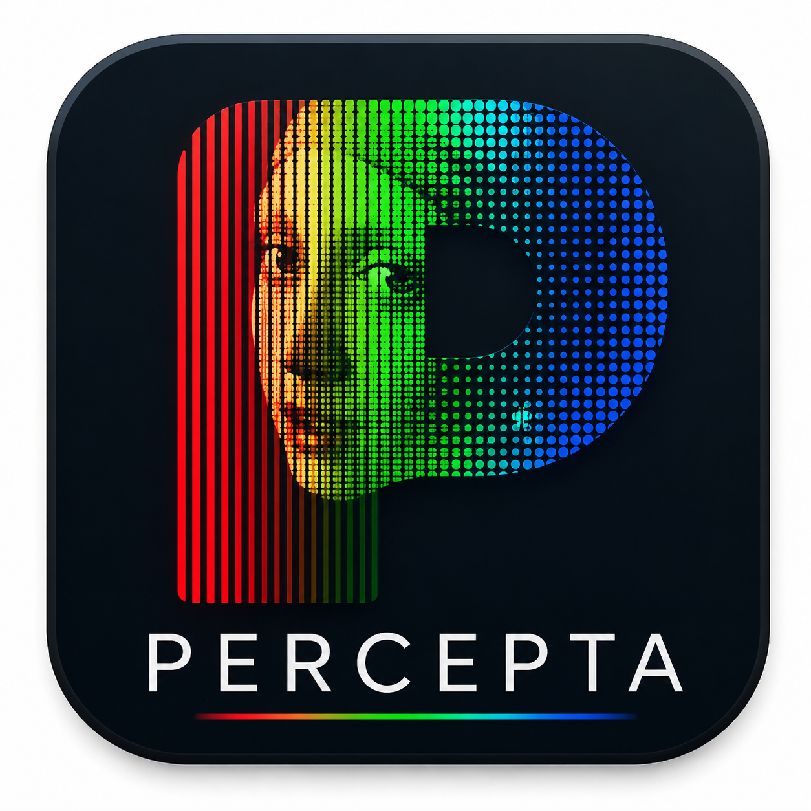
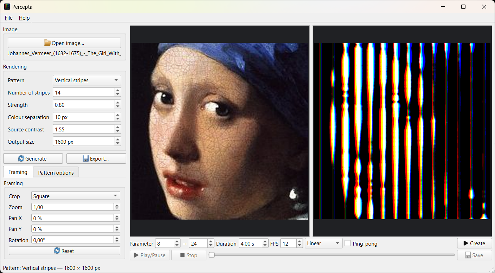
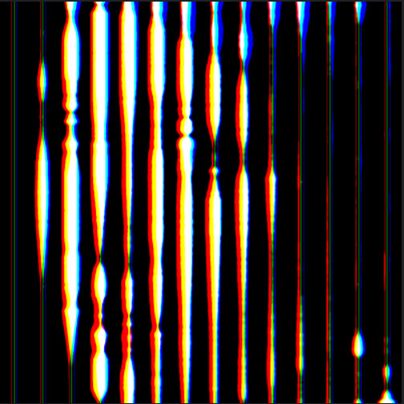
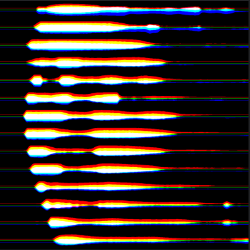
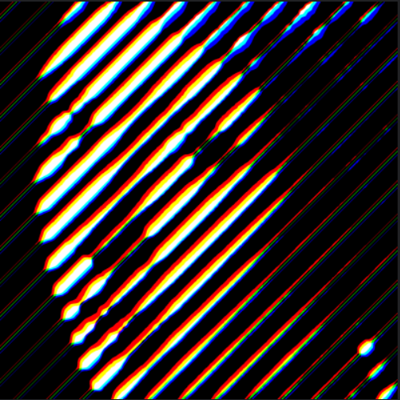
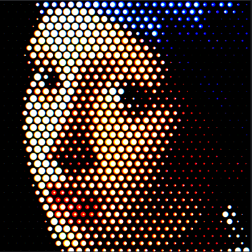
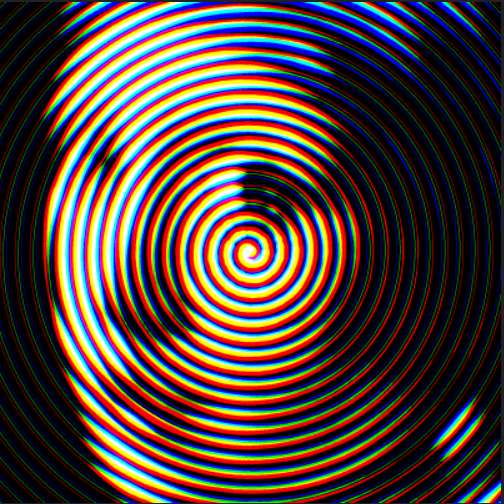

# Percepta

<p align="center">
  
</p>

<p align="center"><strong>Perceptual pattern image generator</strong></p>

Percepta is a desktop application that transforms an ordinary image into a structured RGB pattern made of coloured stripes, dots or a continuous spiral.

At close range, the geometric pattern is clearly visible. When the image is viewed from farther away — or displayed at a smaller size — the red, green and blue structures blend together and the original picture becomes recognisable again.

## Main features

- Vertical, horizontal and diagonal RGB stripes
- Square and hexagonal halftone patterns
- Continuous RGB spiral rendering
- Crop, zoom, pan and rotation controls
- Adjustable pattern density, strength, colour separation and contrast
- Density and spacing animations
- PNG, TIFF, PDF and SVG image export
- GIF, MP4 and WebM animation export
- Drag-and-drop image loading

## Interface



The source image is displayed in the centre of the window and the generated perceptual pattern appears on the right. Rendering, framing and animation controls are grouped in the left and lower panels.

## Quick start

1. Run `main.py`.
2. Open an image or drag it into the application window.
3. Select one of the available patterns.
4. Adjust the framing and the main rendering parameters.
5. Click **Generate**.
6. View the result at different sizes or distances.
7. Export the image or create an animation.

## Pattern gallery

<table>
<tr>
<td width="50%"><br><strong>Vertical stripes</strong></td>
<td width="50%"><br><strong>Horizontal stripes</strong></td>
</tr>
<tr>
<td><br><strong>Diagonal stripes</strong></td>
<td><br><strong>Halftone</strong></td>
</tr>
<tr>
<td><br><strong>Hexagonal halftone</strong></td>
<td><br><strong>Spiral stripes</strong></td>
</tr>
</table>

## Animation


Percepta can animate the density or spacing of the selected pattern. The animation may be previewed in the application and exported as GIF, MP4 or WebM.

## Installation

### Requirements

- Python 3.10 or later
- PyQt6
- NumPy
- Pillow
- `imageio` and `imageio-ffmpeg` for MP4 and WebM export

### Windows

```powershell
python -m venv .venv
.venv\Scripts\activate
python -m pip install PyQt6 numpy Pillow imageio imageio-ffmpeg
python main.py
```

### Linux or macOS

```bash
python3 -m venv .venv
source .venv/bin/activate
python -m pip install PyQt6 numpy Pillow imageio imageio-ffmpeg
python main.py
```

## Documentation

The complete technical documentation, including the rendering principles, controls, export options and troubleshooting information, is available in:

**[Percepta Manual](Percepta_Manual.pdf)**


## Licence

This project is distributed under the [MIT License](LICENSE).

© 2026 Virgile Adam
