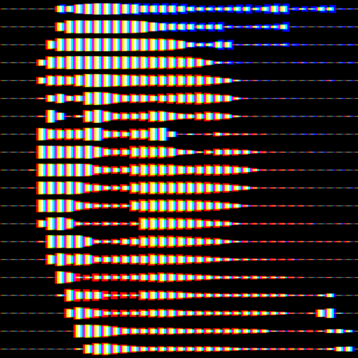
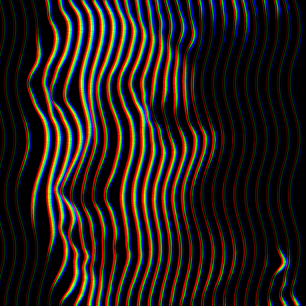
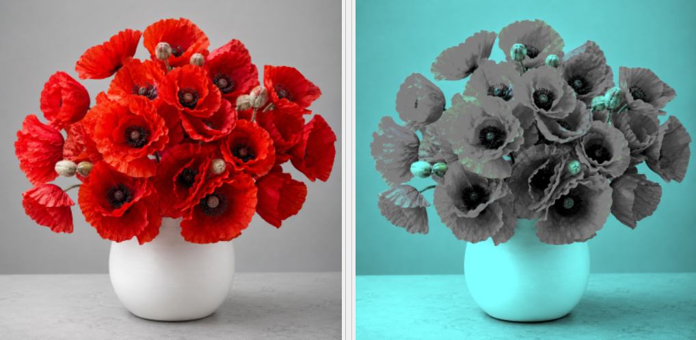
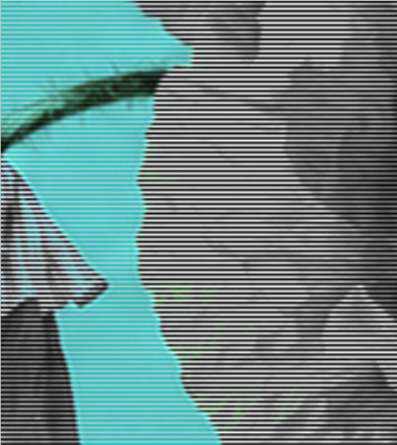

# Percepta

<p align="center">
  
</p>

<p align="center"><strong>Perceptual pattern and subjective-colour image generator</strong></p>

Percepta is a desktop application that transforms an ordinary image using two distinct perceptual approaches:

1. **Geometric patterns**, where local image intensities control coloured or monochrome stripes, segmented scanlines, warped lines, dots or a continuous spiral.
2. **Subjective-colour scanlines**, where a selected colour is removed as a chromatic pixel colour and may nevertheless be perceived through alternating channel-decomposition lines.

## Main features

- Vertical, horizontal and diagonal RGB stripes
- Segmented RGB scanlines made of discrete dashes
- Parallel RGB lines warped by local image luminance
- Square and hexagonal halftone patterns
- Continuous RGB spiral rendering
- Subjective red, green or blue simulation by alternating scanlines
- Optional monochrome rendering for all geometric RGB pattern families
- Independent zoom controls for the source and generated previews
- Crop, crop zoom, pan and rotation controls
- Adjustable pattern density, strength, colour separation and contrast
- Density and spacing animations
- PNG, TIFF, PDF and SVG image export
- GIF, MP4 and WebM animation export
- Drag-and-drop image loading

## Quick start

1. Run `main.py`.
2. Open an image or drag it into the application window.
3. Select a pattern.
4. Adjust framing and the main rendering parameters.
5. For a geometric pattern, enable **Monochrome output** when a white-on-black rendering is required.
6. Use the preview **-**, **1:1**, **Fit** and **+** controls, the mouse wheel and the scrollbars to inspect either preview.
7. Click **Generate** and export the result.

The preview zoom controls do not change the image or simulate viewing distance. They only change the on-screen magnification. Use **Crop zoom**, **Pan X** and **Pan Y** to modify the source framing.

## Geometric pattern gallery

<table>
<tr>
<td width="50%"><br><strong>Vertical stripes</strong></td>
<td width="50%"><br><strong>Horizontal stripes</strong></td>
</tr>
<tr>
<td><br><strong>Diagonal stripes</strong></td>
<td><br><strong>Segmented scanlines</strong></td>
</tr>
<tr>
<td><br><strong>Wavy lines</strong></td>
<td><br><strong>Halftone</strong></td>
</tr>
<tr>
<td><br><strong>Hexagonal halftone</strong></td>
<td><br><strong>Spiral stripes</strong></td>
</tr>
</table>

## Monochrome output

For the geometric pattern families, **Monochrome output** converts the prepared source to perceptual luminance, removes RGB separation and renders the selected geometry as one aligned white pattern on black. It is not applied to **Subjective colour scanlines**, which uses a different encoding model.

## Subjective colour scanlines

This mode is separate from the geometric pattern families. It does not convert channel values into line width, dot size or displacement. Instead, it alternates two horizontal scanline families.

For red simulation, a source pixel `(R,G,B)` is decomposed as:

```text
first scanline family:  (R,R,R)
second scanline family: (0,G,B)
```

Green and blue simulations use the equivalent channel permutations:

```text
Green: (G,G,G) / (R,0,B)
Blue:  (B,B,B) / (R,G,0)
```

A pure red area `(255,0,0)` therefore becomes alternating white and black scanlines. It contains no red-coloured pixel. A neighbouring white area becomes alternating white and cyan scanlines. The contrast between a neutral black/white region and its cyan surroundings can produce a subjective impression of red.

<p align="center">
  
</p>

In the output on the right, the poppies can still appear reddish even though the selected red component is never emitted as a red chromatic pixel.

<p align="center">
  
</p>

The magnified view contains grayscale and cyan-family scanlines, but no pixel whose red component exceeds both green and blue. The effect depends on scanline size, display resampling, viewing conditions and the observer, so its strength is not guaranteed on every screen.

## Animation


Percepta can animate the density or spacing parameter of the selected pattern. The animation may be previewed in the application and exported as GIF, MP4 or WebM.

## Installation

### Requirements

- Python 3.10 or later
- PyQt6
- NumPy
- Pillow
- `imageio` and `imageio-ffmpeg` for MP4 and WebM export

### Windows

```powershell
python -m venv .venv
.venv\Scripts\activate
python -m pip install PyQt6 numpy Pillow imageio imageio-ffmpeg
python main.py
```

### Linux or macOS

```bash
python3 -m venv .venv
source .venv/bin/activate
python -m pip install PyQt6 numpy Pillow imageio imageio-ffmpeg
python main.py
```

## Documentation

The complete technical documentation, including the two encoding approaches, controls, mathematical models, export options and troubleshooting information, is available in:

**[Percepta Manual](Percepta_Manual.pdf)**

## Licence

This project is distributed under the [MIT License](LICENSE).

© 2026 Virgile Adam
